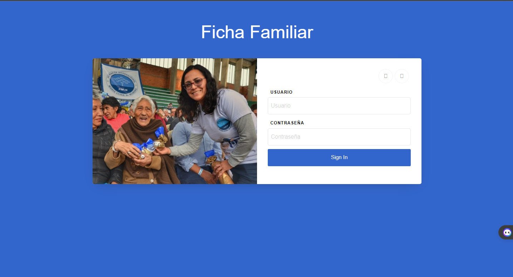
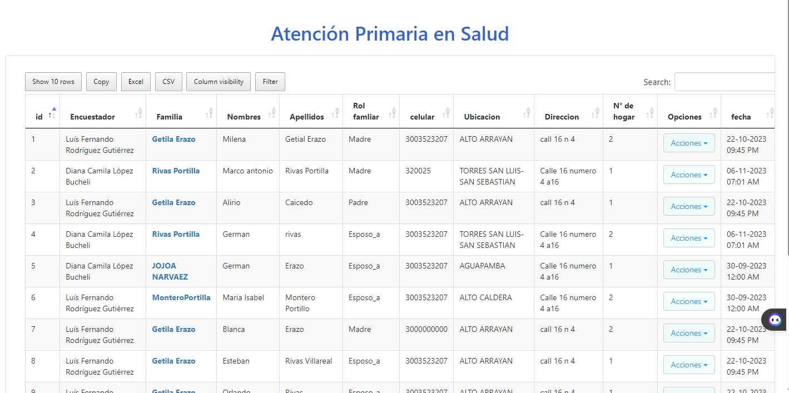
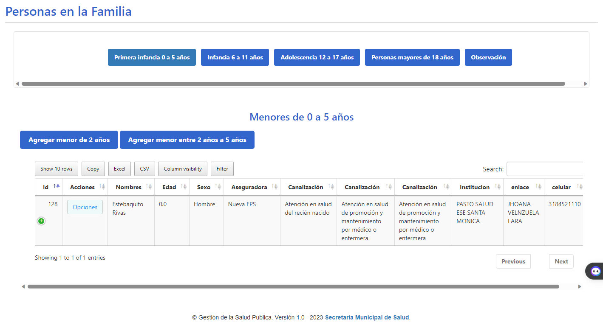

# Sistema De Informacion Para la Caracterizacion Familiar 

Este proyecto colaborativo  enfocado en la caracterizacion de las familias mediante una encuesta diseñada para clasificar las necesidades medicas y de apoyo social que necesita cada familia.
la aplicacion esta desarrollada en Cake PHP.

Estas son otras vistas que sirven para gestionar los datos

